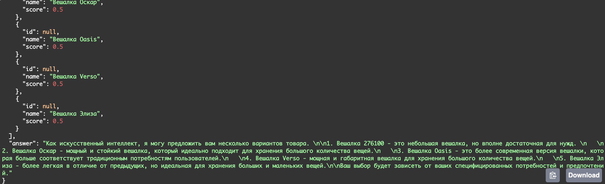

# Product Search API with Ollama LLM

FastAPI-приложение для поиска товаров в Qdrant и генерации рекомендаций с помощью модели Ollama Qwen2-0.5B.

## Описание

Приложение выполняет следующие шаги:

1. Пользователь вводит произвольный текстовый запрос.
2. Модель Ollama Qwen2-0.5B выделяет название товара из запроса.
3. По выделенному названию выполняется поиск в базе Qdrant с использованием плотных и разреженных эмбеддингов.
4. Модель Ollama Qwen2-0.5B генерирует рекомендации по найденным товарам.
5. Возвращается JSON с найденными товарами и рекомендациями.

## Использование API

### Endpoint `/search`

**GET** `/search?query=<текстовый_запрос>`

Пример запроса:

```

[http://127.0.0.1:8000/search?query=Холодильник](http://127.0.0.1:8000/search?query=хочу вешалку какую-нибудь\&top\_k=5

````

Пример ответа:

```json
{
  "results": [
    {
      "id": 1,
      "name": "Вешалка 276100",
      "score": 0.5
    },
    {
      "id": 3,
      "name": "Вешалка Оскар",
      "score": 0.5
    },
    {
      "id": 3,
      "name": "Вешалка Oasis",
      "score": 0.5
    },
    {
      "id": 4,
      "name": "Вешалка Verso",
      "score": 0.5
    },
    {
      "id": 5,
      "name": "Вешалка Элиза",
      "score": 0.5
    }
  ],
  "answer": "Как искусственный интеллект, я могу предложить вам несколько вариантов товара. \n\n1. Вешалка 276100 - это небольшая вешалка, но вполне достаточная для нужд. \n   \n2. Вешалка Оскар - мощный и стойкий вешалка, который идеально подходит для хранения большого количества вещей.\n   \n3. Вешалка Oasis - это более современная версия вешалки, которая больше соответствует традиционным потребностям пользователей.\n   \n4. Вешалка Verso - мощная и габаритная вешалка для хранения большого количества вещей.\n   \n5. Вешалка Элиза - более легкая в отличие от предыдущих, но идеальная для хранения больших и маленьких вещей.\n\nВаш выбор будет зависеть от ваших специфицированных потребностей и предпочтений."
}
````

* `results` — список найденных товаров из Qdrant (payload без score).
* `answer` — текстовые рекомендации от модели Ollama.



