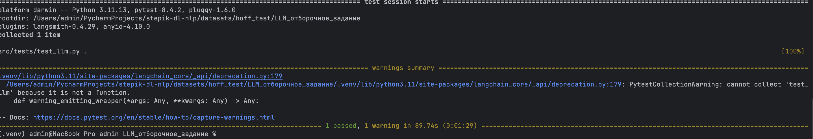

# Проверка качества ответов LLM

- Подготовлены примеры с вопросами и правильными ответами.
- Автоматическая проверка LLM по метрикам:
  - Faithfulness
  - FactualCorrectness
- Метрики оцениваются относительно порога (**threshold = 0.5**).
- Реализован pytest-тест для автоматической проверки, что все оценки >= threshold.

